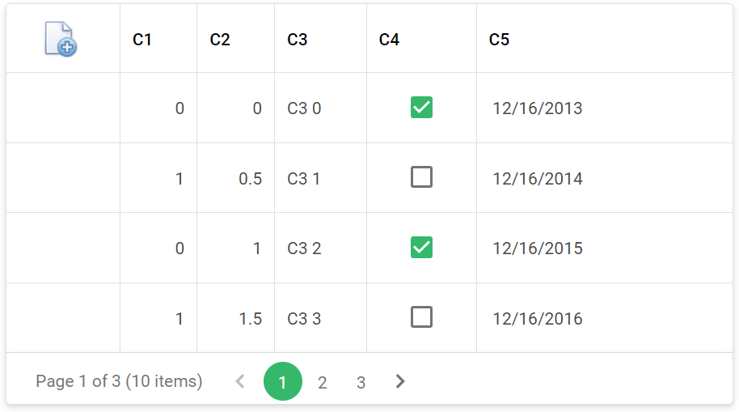

<!-- default badges list -->

[](https://supportcenter.devexpress.com/ticket/details/T529995)
[](https://docs.devexpress.com/GeneralInformation/403183)
<!-- default badges end -->
# Grid View for ASP.NET Web Forms - How to display a command or custom button in hot-tracked rows only

This example demonstrates how to use CSS classes to hide command or custom buttons and display them in hot-tracked rows only.



## Overview

Set the grid's [EnableRowHotTrack](https://docs.devexpress.com/AspNet/DevExpress.Web.ASPxGridViewBehaviorSettings.EnableRowHotTrack) property to `true` to allow the grid to highlight hot-tracked rows.

```aspx
<dx:ASPxGridView ID="gridView" runat="server" ... >
    <!-- ... --> 
    <SettingsBehavior EnableRowHotTrack="true" />
</dx:ASPxGridView>
```

Create a button and specify its visibility in a CSS class. To display the button in a hot-tracked row, add the CSS class to the grid's [RowHotTrack](https://docs.devexpress.com/AspNet/DevExpress.Web.GridViewStyles.RowHotTrackCreate) property.

```css
.hottrackButton {
    visibility: hidden;
}
.hottrackRow .hottrackButton {
    visibility: visible;
}
```

```aspx
<SettingsCommandButton>
    <EditButton RenderMode="Image" Image-IconID="edit_edit_32x32">
        <Styles>
            <Style CssClass="hottrackButton" />
        </Styles>
    </EditButton>
</SettingsCommandButton>
<Columns>
    <dx:GridViewCommandColumn ShowEditButton="True" ... />
</Columns>
<Styles>
    <RowHotTrack CssClass="hottrackRow"></RowHotTrack>
</Styles>
```

## Files to Review

* [Default.aspx](./CS/Default.aspx) (VB: [Default.aspx](./VB/Default.aspx))
* [Default.aspx.cs](./CS/Default.aspx.cs) (VB: [Default.aspx.vb](./VB/Default.aspx.vb))
